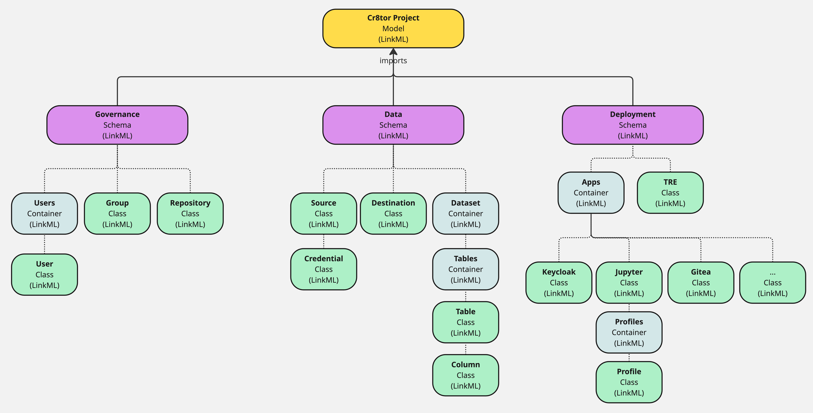

# Cr8tor Metamodel

This documentation describes the data metamodel definition for a Cr8tor project. Using LinkML, it outlines base data entities and attributes required to generate pydantic models for use across the Cr8tor CLI, K8s Operator and supporting approvals, publishing microservices. In particular, it provides a metamodel rooted in established data schemas (e.g. SCIM, Schema.org) to produce JSON-LD, RDF and OpenAPIv3 specification equivalent outputs to represent validate RO-Crate and K8s Custom Resource definition (CRDs) resources. 

